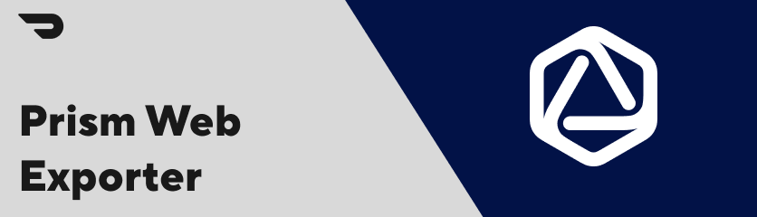

# Prism Web Token Exporter

This exporter, takes the tokens that are stored in Supernova, and outputs them in the format required for Prism Web.

## Getting Started

- Open this subdirectory in VSCode
- Download the VSCode Supernova extension [here](https://marketplace.visualstudio.com/items?itemName=SupernovaIO.pulsar-vsc-extension).
- Login to Supernova and [generate a new auth token](https://cloud.supernova.io/user-profile/authentication)
- Copy the token
- Go to the VSCode Supernova extension and click login
- Paste your auth token into the prompt
- Click "Select Design System"
- Then click "DoorDash" -> "Prism" -> "shared draft" -> "default"
- Do not apply any theme

You should now be able to hit the little play button in the "Design System Context" section (it appears when you mouse over the section) to run the exporter. The generated theme files will be in the `.build` folder.

## Output Structure

```
[ThemeName] -
  |- index.ts
  |- base / usage / comp
    |- [tokenType].ts
    |- index.ts
```
